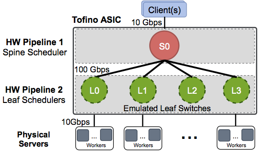
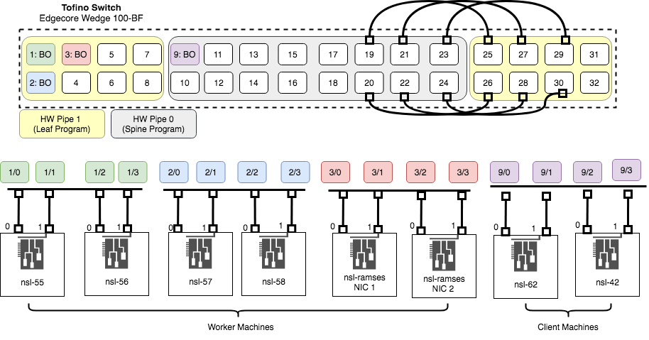

# horus-p4
This repo contains the P4 implementation for NSDI'24 paper, **Horus: Granular In-Network Task Scheduler for Cloud Datacenters**.

## Repository Structure

p4_16/targets/[tofino](https://github.com/parhamyassini/saqr-p4/tree/master/p4_16/targets/tofino) Contains the P4-16 programs written for TNA architecture. 
There are three main programs in this repository. The headers and parsers are common between these programs. Each program contains leaf and spine logic and runs each on one of the hardware pipelines and a controller which configures the tables.  
1. Horus
Under the directory "saqr". Contains the Horus implementation for TNA architecture. It also contains some legacy codes and python testcases. 
>Note that the python testcases in saqr directory where initially used to confirm the expected behaviour; but we have modified the code ever since (as we ran experiments on the hardware switch). Therefore, the testcases might need some modificaions.
 
2. **R**acksched-**R**andom **(RS-R)**
 Contains the implementation of [RackSched](https://github.com/netx-repo/RackSched) in P4-16 for leaf switches. We only added the necessary codes to support multiple virtual clusters and support large number of nodes (instead of 8 workers in the original implementation). We also use virtual cluster feature to emulate multiple leaf switches in our testbed topology (similar to what we did for Horus, as explained in next section). 
The spine switch randomly selects one of the racks for a task.

3. **R**acksched-**H**ierarchical **(RS-H)**
 Similar to RS-R but we have extended the solution to support multiple racks by replicating the RackSched logic at both spine and leaf layers:
In leaf program, we add support for sending state updates from leaf to spine. In this setup, each leaf scheduler keeps track of average load in rack and sends this value to the spine after receiving a reply from a worker in the rack.
The spine implements the Racksched policy and similar to leaf switches, uses power-of-two choices to select a rack for a task. 

## Experiment Setup and Configurations
### Network topology and switch connections
The figure below shows the high-level design of the testbed setup used in our experiments: 
We use two machines as clients and four *or* five machines as workers (depending on Skewed or Balanced placement experiments).



The figure below shows the exact connections between switch ports and machines in our testbed:



### Emulating multiple leaves in P4 Program
The current implementation uses the Virtual Cluster (VC) feature to emulate different leafs. The spine program assigns the ```hdr.horus.cluster_id``` based on the selected leaf (this is done when selecting output port). Therfore, each leaf will only have access to the workers in that cluster. 
 The leaf programs first checks the ```hdr.horus.cluster_id```, and based on that each leaf has access to an isolated part of the register arrays. In Horus, each VC has the following registers:   linkage register, Load list register arrays (including the load and drift arrays), idle counter register (used as pointer to the idle list) and idle list register array. 
The controller is responsible for managing this virtualization as it configures the intial setup for the placement of workers. The current controller codes provide two setup configs used in our experiments: Skewed and Uniform.
The physical connections between machines and switch do not need to be changed for the two mentioned setps.
> Important note: The parts of the codes that are only used for *our testbed experiments* are marked in comments with tag: "TESTBEDONLY". These lines do not need to be there if we are not going to emulate multiple leaves. The instructions are given in comments for what should be changed the case that each leaf runs on an actuall switch.

### Instructions for changing placement setups
There are some important configs that should be done both in controller and in the [worker machines](https://github.com/parhamyassini/saqr-app-eval) (shinjuku configs) to change the setups.
We summerize these in here:

## Building and Running the Codes

#### SSH to the tofino switch  
```
ssh <user>@<address>
```

#### Clone the repository.


#### Link Common Barefoot Libraries
If you are building artifacts for the first time, you should make a soft link from the `common` file to the common libraries of bf-sde. For create the linkage 
```
ln -s $SDE_INSTALL/pkgsrc/p4-examples/p4_16_programs/common/ p4_16/targets/tofino/common
``` 

#### Build the P4 Programs.
Each program should be built seprately. The main P4 file for each program contains leaf and spine logics no need to build leaf/spine seperatly. Example: main file for Horus is "horus.p4" which includes the the headers, parser, leaf, and spine implementation.

To build the program we use this script:
```
~/tools/p4_build.sh <path-to-main-p4-file>
```

#### Modify the config file generated by the compiler.
> This step should be done for every program and after the build step.

Each compiled program has a config file generated by the tool which will be used when running the program on the switch. This config file includes both spine and leaf pipe configs. By default, the compiler assumes that switch has four hardware pipelines, but the current switch (EdgeCore Wedge 100BF) has two pipelines. We modify this file to tell the switch run leaf and spine on which pipes. 

The path to the config file is as follows:
```
/home/p4/bf-sde-9.5.0/install/share/p4/targets/tofino/<program-name>.conf
```
In the json file, under ```p4_devices -> p4_programs -> p4_pipelines``` there will be two programs shown under "p4_pipeline_name". In our case, the names for the two programs are "pip_leaf" and "pipe_spine". We need to modify the ""pipe_scope" for these two programs. By default the first one will have a pipe_scope: [0, 2] and second one will have [1, 3]. 
For our switch we will only keep the pipes 0 and 1: 
```
# For the first program (spine)
...
"pipe_scope": [0],
...

# For the second program (leaf)
...
"pipe_scope": [1],
...
``` 

#### Run the code on switch
```
cd $SDE
sudo -E ./run_switchd.sh -p <program-name>
```

#### Setup ports

There are two options to setup the ports: Manual or Automated.

For **manual** setup, follow these instructions:

In the bf-shell insert the following commands:
```
bfshell> ucli
bf-sde> pm
```

Now that we are in port manager, we will execute the port setup commands from the "port_commands.txt".
Simply copy and paste these commands to the CLI. 

For **automated** setup, run the following command:
```
sudo -E ./run_bfshell.sh -b /home/p4/Projects/horus_controller/scripts/tofino/ports.py
```


To **verify** that ports are enabled after setting up the ports, either using the Manual or Automated option, run the following commands from a ```bf_shell``` session:
```
bfshell> ucli
bf-sde> pm.show
```

Under the "OPR" column,  port status should be "UP", otherwise port is "DOWN". Also, the numbers shown under "D_P" column are the port numbers that are used by the controller. E.g, to forward packet to port 1/0 (first link of the breakout cable), the egress port should set to 132. 

#### Run the controller
Open another shell to the switch contoller and in the second terminal window do the following:

```
cd <path-to-project-dir>
```
Simply run the controller for the program using python. Example:
```
python rs_h_controller.py <placement-setup-arg>
```
The "\<placement-setup-arg\>" can be either "b" (balanced) or "s" (skewed) for the two setups in our experiments.

### Run the Workers and Clients
Documentation on setting up workers and clients are provided in [this repo](https://github.com/parhamyassini/saqr-app-eval).

### Collecting overhead results
For RackSched-Hierarchical (RS-H), for each reply packet from worker, leaf sends an update message to spine. Also, there are no resubmissions.

For Horus, the controller prints out the leaf resubmissions in total we use that to calculate the the percentage of tasks resubmitted. It also, prints out the the total number of state update messages (load and idle linkage msgs). In addition, we report the total number of resubmissions at spine switch which includes idle remove procedure (used for calculating total processing overheads).

## Known issues
 XXX